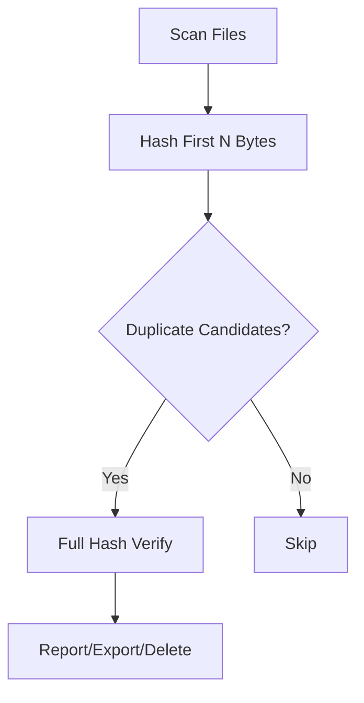

# Duplicate File Finder 🔍

A high-performance, parallel Python tool to detect and manage duplicate files — with flexible hashing, logging, reporting, and safe deletion options.

---

## ⚡ Features

- ✅ **Parallel hashing** for large-scale scanning (6x+ faster)
- 🎯 **Accuracy modes**: Full, Quick (4KB), Multi-region
- 📁 **Recursive scan** with symlink/hidden file filtering
- 🧾 **Export results** to JSON/CSV
- 🧼 **Safe deletion** with dry-run, force, and interactive modes
- 📦 **Saving space analysis** included in report
- 📜 **Verbose logging** with optional file log

---

## 📦 Installation

```bash
git clone https://github.com/ahmadqmalzoubi/file-duplicate-finder.git
cd file-duplicate-finder
pip install -r requirements.txt
```

---

## 🚀 Usage

```bash
# Full scan with accurate deduplication
python3 file-duplicate-finder.py ~/data

# Fast mode (first 4KB only)
python3 file-duplicate-finder.py ~/data --quick

# High-accuracy mode (first/middle/last 4KB)
python3 file-duplicate-finder.py ~/data --multi-region

# Export results
python3 file-duplicate-finder.py ~/data --json-out duplicates.json --csv-out duplicates.csv

# Simulate deletion (dry-run)
python3 file-duplicate-finder.py ~/data --delete --dry-run

# Real deletion with confirmation
python3 file-duplicate-finder.py ~/data --delete

# Force deletion without confirmation
python3 file-duplicate-finder.py ~/data --delete --force

# Interactive deletion per group
python3 file-duplicate-finder.py ~/data --delete --interactive
```

---

## 🛠️ Command-Line Options

| Flag              | Description                                     | Default     |
|-------------------|-------------------------------------------------|-------------|
| `--quick`         | Fast but less accurate (hash first 4KB)         | `False`     |
| `--multi-region`  | Hash 3 parts (start/middle/end) for accuracy    | `False`     |
| `--minsize`       | Minimum file size to consider (bytes)          | `4096`      |
| `--maxsize`       | Maximum file size to consider (bytes)          | `4GB`       |
| `--threads`       | Number of hashing threads                      | Auto        |
| `--logfile`       | Path to save log output                         | None        |
| `--loglevel`      | Set logging verbosity (debug/info/warning/...)  | `info`      |
| `--json-out`      | Save results as JSON                            | None        |
| `--csv-out`       | Save results as CSV                             | None        |
| `--delete`        | Enable duplicate deletion                       | `False`     |
| `--dry-run`       | Simulate deletion without removing files        | `True`      |
| `--force`         | Skip deletion confirmation                      | `False`     |
| `--interactive`   | Confirm deletion of each group manually         | `False`     |

---

## 📊 Performance Tips

- **SSDs / NVMe**: Use `--threads 16` or more
- **Network storage**: Use `--threads 4-8`
- **Fast scan**: `--quick` + high threads
- **Accurate scan**: `--multi-region` + dry-run

---

## 💡 How It Works

1. **Phase 1**: Group files by size  
2. **Phase 2**: Hash files in parallel (configurable mode)  
3. **Phase 3**: (If needed) Verify groups using full hashing  
4. **Phase 4**: Report or delete duplicates



---

## 🔐 Safety-First Deletion

- Only extra copies in each duplicate group are deleted
- Default mode is dry-run (`--dry-run`)
- Use `--interactive` for manual review
- Use `--force` for automatic cleanup

---

## 🤝 Contributing

1. Create a feature branch:
   ```bash
   git checkout -b feat/my-feature
   ```
2. Follow PEP 8 conventions
3. Test changes:
   ```bash
   python3 -m doctest file-duplicate-finder.py
   ```

---

## 📜 License

This project is licensed under the **GNU General Public License v3.0**.

See the [LICENSE](LICENSE) file for details.