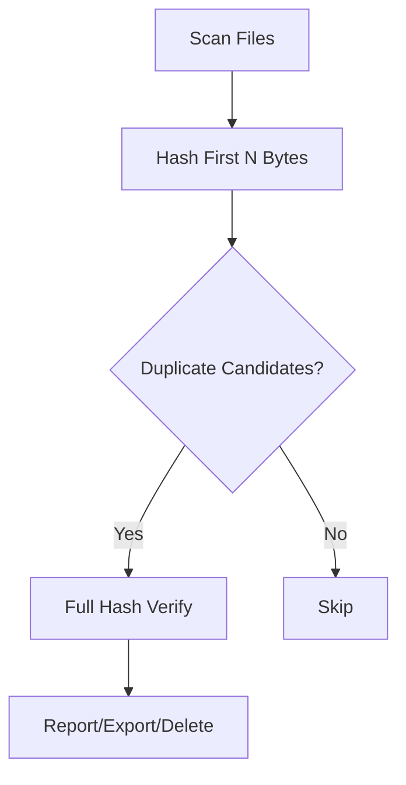

# Duplicate File Finder 🔍

A high-performance, parallel Python tool to detect and manage duplicate files — with flexible hashing, logging, reporting, and safe deletion options.

---

## ⚡ Features

- ✅ **Parallel hashing** for large-scale scanning (6x+ faster)
- 🎯 **Accuracy modes**: Full, Quick (4KB), Multi-region
- 📁 **Recursive scan** with symlink/hidden file filtering
- 🧾 **Export results** to JSON/CSV
- 🧼 **Safe deletion** with dry-run, force, and **interactive file-level selection**
- 📦 **Saving space analysis** included in report
- 📜 **Verbose logging** with optional file log

---

## 📦 Installation

```bash
git clone https://github.com/ahmadqmalzoubi/file-duplicate-finder.git
cd file-duplicate-finder
pip install -r requirements.txt
```

---

## 🚀 Usage

### Command-Line Interface (CLI)

To get started, you can run a scan on a directory using the following command:
```bash
python3 -m filedupfinder.cli ~/data
```

Here are some common examples:

- **Fast mode (first 4KB only):**
  ```bash
  python3 -m filedupfinder.cli ~/data --quick
  ```

- **High-accuracy mode (first/middle/last 4KB):**
  ```bash
  python3 -m filedupfinder.cli ~/data --multi-region
  ```

- **Export results:**
  ```bash
  python3 -m filedupfinder.cli ~/data --json-out duplicates.json --csv-out duplicates.csv
  ```

- **Simulate deletion (dry-run):**
  ```bash
  python3 -m filedupfinder.cli ~/data --delete --dry-run
  ```

- **Interactive deletion per group with file selection:**
  ```bash
  python3 -m filedupfinder.cli ~/data --delete --interactive
  ```

### Graphical User Interface (GUI)

This tool also includes a graphical interface built with PySide6. To run it, you first need to install the GUI dependencies:

```bash
pip install -r requirements.txt
```

Then, you can launch the GUI with the following command:
```bash
python3 -m gui.gui_app
```
Alternatively, if you installed the package, you can use the entry point:
```bash
filedupfinder-gui
```
The GUI provides an intuitive way to:
- Select a folder to scan.
- View duplicate files in a sortable table.
- Filter results by path and file size.
- Delete selected files safely.
- Export results to JSON or CSV.

---

## 🛠️ Command-Line Options

| Flag              | Description                                                       | Default |
|-------------------|-------------------------------------------------------------------|---------|
| `path`            | The base directory to start scanning from.                        | (Required) |
| `--quick`         | Fast but less accurate (hash first 4KB)                           | `False` |
| `--multi-region`  | Hash 3 parts (start/middle/end) for accuracy                      | `False` |
| `--minsize`       | Minimum file size to consider (bytes)                             | `4096`  |
| `--maxsize`       | Maximum file size to consider (bytes)                             | `4GB`   |
| `--threads`       | Number of hashing threads                                          | Auto    |
| `--logfile`       | Path to save log output                                            | None    |
| `--loglevel`      | Set logging verbosity (debug/info/warning/...)                    | `info`  |
| `--json-out`      | Save results as JSON                                               | None    |
| `--csv-out`       | Save results as CSV                                                | None    |
| `--delete`        | Enable duplicate deletion                                          | `False` |
| `--dry-run`       | Simulate deletion without removing files                           | `True`  |
| `--force`         | Skip deletion confirmation                                         | `False` |
| `--interactive`   | Prompt before deleting each group; choose files by number          | `False` |
| `--exclude`       | Glob pattern to exclude files (e.g. `*.bak`, `Thumbs.db`)          | None    |
| `--exclude-dir`   | Directory names to exclude (e.g. `.git`, `node_modules`)           | None    |
| `--exclude-hidden`| Exclude hidden files and directories (starting with dot)           | `False` |

---

## 📊 Performance Tips

- **SSDs / NVMe**: Use `--threads 16` or more
- **Network storage**: Use `--threads 4-8`
- **Fast scan**: `--quick` + high threads
- **Accurate scan**: `--multi-region` + dry-run

---

## 💡 How It Works

1. **Phase 1**: Group files by size  
2. **Phase 2**: Hash files in parallel (configurable mode)  
3. **Phase 3**: (If needed) Verify groups using full hashing  
4. **Phase 4**: Report or delete duplicates



---

## ✋ Interactive Deletion Mode

When using `--delete --interactive`, you will be prompted for each duplicate group.

You can:

- Type `a` to delete **all but the first** file (safe default)
- Enter a list of file numbers to delete specific ones (e.g. `1,2,3`)
- Type `s` to **skip** the group

Example prompt:
```
📂 Duplicate group (Size: 2.1 MB, Hash: 91ac5e2a):
  [0] /home/user/docs/file1.pdf
  [1] /home/user/Downloads/file1 (copy).pdf
  [2] /mnt/backup/file1 (1).pdf
Enter number(s) of files to delete (comma-separated), 'a' for all but first, or 's' to skip:
```

---

## 🔐 Safety-First Deletion

- Only extra copies in each duplicate group are deleted
- Default mode is dry-run (`--dry-run`)
- Use `--interactive` for manual review
- Use `--force` for automatic cleanup

---

## 🤝 Contributing

1. Create a feature branch:
   ```bash
   git checkout -b feat/my-feature
   ```
2. Follow PEP 8 conventions
3. Test changes:
   ```bash
   python3 -m doctest file-duplicate-finder.py
   ```

---

## 📜 License

This project is licensed under the **GNU General Public License v3.0**.

See the [LICENSE](LICENSE) file for details.