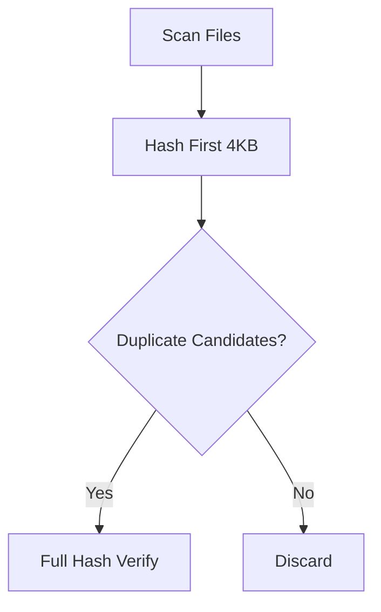

# Duplicate File Finder 🔍

A high-performance Python tool to find duplicate files with configurable accuracy/speed tradeoffs, featuring:
- **Parallel processing** (6x faster than single-thread)
- **Multi-region hashing** (detect more duplicates)
- **Smart filtering** (ignore hidden files/symlinks)

## 📦 Installation
```bash
git clone https://github.com/ahmadqmalzoubi/file-duplicate-finder.git
cd file-duplicate-finder
pip install -r requirements.txt  # tqdm, psutil (optional)
```

## 🚀 Usage
```bash
# Basic scan (100% accurate)
python3 file-duplicate-finder.py ~/your_directory

# Fast mode (first 4KB only)
python3 file-duplicate-finder.py ~/your_directory --quick

# High-accuracy mode (first/middle/last 4KB)
python3 file-duplicate-finder.py ~/your_directory --multi-region

# Custom threads (default: CPU cores + 4)
python3 file-duplicate-finder.py ~/large_dir --threads 8
```

## 🛠️ Options
| Flag            | Description                          | Default |
|-----------------|--------------------------------------|---------|
| `--quick`       | Fast but less accurate mode          | `False` |
| `--multi-region`| Hash 3 file regions for better accuracy | `False` |
| `--minsize`     | Minimum file size (bytes)            | `4096`  |
| `--maxsize`     | Maximum file size (bytes)            | `4GB`   |
| `--threads`     | Parallel threads count               | Auto    |

## 📊 Performance Tips
- For **SSDs/NVMe**: Use `--threads 16-32`  
- For **network drives**: Use `--threads 4-8`  
- For **initial scans**: `--quick` + `--threads max`  
- For **final verification**: `--multi-region`  

## 🔍 How It Works
1. **Phase 1**: Index files by size (single-thread)
2. **Phase 2**: First-pass hashing (parallel)
3. **Phase 3**: Full verification (parallel if needed)



## 🤝 Contributing
1. Create a feature branch:  
   ```bash
   git checkout -b feat/your-feature
   ```
2. Follow PEP 8 style guide  
3. Test changes:  
   ```bash
   python3 -m doctest file-duplicate-finder.py
   ```
   