# Duplicate File Finder 🔍

A high-performance, parallel Python tool to detect and manage duplicate files — with flexible hashing, logging, reporting, and safe deletion options.

---

## ⚡ Features

- ✅ **Parallel hashing** for large-scale scanning (6x+ faster)
- 🎯 **Accuracy modes**: Full, Quick (4KB), Multi-region
- 📁 **Recursive scan** with symlink/hidden file filtering
- 🧾 **Export results** to JSON/CSV
- 🧼 **Safe deletion** with dry-run, force, and **interactive file-level selection**
- 📦 **Saving space analysis** included in report
- 📜 **Verbose logging** with optional file log

---

## 📦 Installation

```bash
git clone https://github.com/ahmadqmalzoubi/file-duplicate-finder.git
cd file-duplicate-finder
pip install -r requirements.txt
```

---

## 🚀 Quick Start

### **Basic Usage**
```bash
python -m filedupfinder ~/data
```

### **Quick Scan (Fast but less accurate)**
```bash
python -m filedupfinder ~/data --quick
```

### **Multi-Region Scan (More accurate)**
```bash
python -m filedupfinder ~/data --multi-region
```

### **Size Filtering**
```bash
python -m filedupfinder ~/data --minsize 5 --maxsize 500
```

### **Export Results**
```bash
python -m filedupfinder ~/data --json-out duplicates.json --csv-out duplicates.csv
```

### **Safe Deletion (Dry Run)**
```bash
python -m filedupfinder ~/data --delete --dry-run
```

### **Interactive Deletion**
```bash
python -m filedupfinder ~/data --delete --interactive
```

### **Performance Benchmark**
```bash
python -m filedupfinder --benchmark
```

### **Legacy Scanning Mode**
```bash
python -m filedupfinder ~/data --legacy-scan
```

### **Demo Mode**
```bash
python -m filedupfinder --demo
```

### **Graphical User Interface (GUI)**

For a user-friendly graphical interface:

```bash
python -m gui.gui_app
```

### Command Line Interface

```bash
# Basic scan
filedupfinder /path/to/scan

# Scan with size limits (in MB)
filedupfinder --minsize 5 --maxsize 500 /path/to/scan

# Quick scan (faster, less accurate)
filedupfinder --quick /path/to/scan

# Exclude certain file types and directories
filedupfinder --exclude "*.tmp,*.bak" --exclude-dir ".git,node_modules" /path/to/scan

# Dry run deletion (see what would be deleted)
filedupfinder --delete --dry-run /path/to/scan

# Actually delete duplicates (keep one copy)
filedupfinder --delete /path/to/scan

# Export results to JSON
filedupfinder --json-out results.json /path/to/scan

# Export results to CSV
filedupfinder --csv-out results.csv /path/to/scan

# Run demo mode (creates test files, scans, shows results, cleans up)
filedupfinder --demo
```

### Graphical User Interface

1. **Launch the GUI:**
   ```bash
   python -m gui.gui_app
   ```

2. **Using the GUI:**
   - Click "Select Folder" to choose a directory to scan
   - Configure scan options (file size limits, exclusions, scan mode)
   - Click "Start Scan" to begin the duplicate detection
   - Use the "🎬 Run Demo" button to see a demonstration with test files
   - Review results in the table and log output
   - Export results to JSON or CSV if needed
   - Enable deletion options to remove duplicates

3. **Demo Mode:**
   - Click the "🎬 Run Demo" button to run a demonstration
   - The demo creates temporary test files with known duplicates
   - Scans the test files and shows results
   - Automatically cleans up when finished
   - Perfect for testing the tool's functionality

---

## 🛠️ Command-Line Options

| Flag              | Description                                                       | Default |
|-------------------|-------------------------------------------------------------------|---------|
| `path`            | The base directory to start scanning from.                        | (Required) |
| `--quick`         | Fast but less accurate (hash first 4KB)                           | `False` |
| `--multi-region`  | Hash 3 parts (start/middle/end) for accuracy                      | `False` |
| `--minsize`       | Minimum file size to consider (MB)                                | `4 MB`  |
| `--maxsize`       | Maximum file size to consider (MB)                                | `4096 MB` (4 GB) |
| `--threads`       | Number of hashing threads                                          | Auto    |
| `--logfile`       | Path to save log output                                            | None    |
| `--loglevel`      | Set logging verbosity (debug/info/warning/...)                    | `info`  |
| `--json-out`      | Save results as JSON                                               | None    |
| `--csv-out`       | Save results as CSV                                                | None    |
| `--delete`        | Enable duplicate deletion                                          | `False` |
| `--dry-run`       | Simulate deletion without removing files                           | `True`  |
| `--force`         | Skip deletion confirmation                                         | `False` |
| `--interactive`   | Prompt before deleting each group; choose files by number          | `False` |
| `--exclude`       | Glob pattern to exclude files (e.g. `*.bak`, `Thumbs.db`)          | None    |
| `--exclude-dir`   | Directory names to exclude (e.g. `.git`, `node_modules`)           | None    |
| `--exclude-hidden`| Exclude hidden files and directories (starting with dot)           | `False` |

---

## 🔄 Performance Tips

### **🚀 Getting the Best Performance**

**Storage Type Recommendations:**
- **SSDs / NVMe**: Use `--threads 16` or more for maximum throughput
- **Network storage (NAS/SMB)**: Use `--threads 4-8` to avoid overwhelming the connection
- **HDDs**: Use `--threads 8-12` for optimal balance
- **USB drives**: Use `--threads 2-4` to avoid bottlenecking the interface

**Scan Strategy Tips:**
- **Fast initial scan**: Use `--quick` + high thread count for quick overview
- **Accurate verification**: Use `--multi-region` for final verification before deletion
- **Large datasets**: Start with `--minsize 10` to skip tiny files
- **Mixed content**: Use `--exclude "*.tmp" --exclude "*.cache"` to skip temporary files

**Memory and Resource Management:**
- **Low memory systems**: Use `--threads 4` to reduce memory usage
- **High-end systems**: Use `--threads 16-32` for maximum performance
- **Network drives**: Add `--exclude-dir ".git" --exclude-dir "node_modules"` to skip version control folders

### **⚡ Performance Optimizations**

This tool includes several performance optimizations that significantly improve scanning speed:

### **🚀 Optimized Scanning (Default)**
- **Parallel File Discovery**: Multi-threaded directory scanning for 2-4x faster file discovery
- **Early Size Filtering**: Files are filtered by size during discovery phase, reducing memory usage
- **Memory Mapping**: Large files (>10MB) use memory mapping for 3-5x faster I/O
- **Optimized Buffer Sizes**: Dynamic buffer sizing based on file size for optimal memory usage
- **Batch Processing**: Files are processed in optimal batch sizes for better thread utilization

### **🔧 Advanced Performance Features**
- **Memory Mapping**: Files >10MB automatically use memory mapping instead of file I/O
- **Adaptive Buffer Sizes**: 
  - Small files (≤8KB): Read entire file at once
  - Medium files (≤1MB): 16KB buffers for good balance
  - Large files (≤100MB): 32KB buffers for optimal performance
  - Very large files (>100MB): 64KB buffers for maximum throughput
- **Load Balancing**: Files sorted by size for better thread distribution
- **Reduced Progress Callbacks**: Less frequent progress updates for better performance
- **Hash Caching**: Avoids re-hashing files that have already been processed

### **📈 Performance Benchmarking**
Run the built-in benchmark to compare performance on your system:
```bash
python -m filedupfinder --benchmark
```

The benchmark compares:
- **Optimized vs Legacy scanning** - Shows the improvement from new algorithms
- **Different thread counts** - Helps find optimal thread count for your system
- **Quick vs Full scan modes** - Demonstrates speed vs accuracy trade-offs
- **Memory usage differences** - Shows resource efficiency improvements

### **🔄 Legacy Mode**
If you need to use the original scanning method for compatibility:
```bash
python -m filedupfinder ~/data --legacy-scan
```

### **📊 Expected Performance Improvements**
- **File Discovery**: 2-4x faster with parallel directory scanning
- **Large Files**: 3-5x faster with memory mapping
- **Overall Performance**: 2-3x faster for typical use cases
- **Memory Usage**: 20-40% reduction with optimized buffering
- **CPU Utilization**: Better load balancing across available cores

---

## 💡 How It Works

The duplicate file finder uses a sophisticated multi-phase approach optimized for both speed and accuracy:

### **🔍 Phase 1: Parallel File Discovery**
- **Multi-threaded scanning**: Multiple threads traverse directories simultaneously
- **Early filtering**: Files are filtered by size, type, and exclusion patterns during discovery
- **Metadata collection**: File sizes, paths, and timestamps are collected efficiently
- **Load balancing**: Files are distributed across threads for optimal processing

### **📊 Phase 2: Size-Based Grouping**
- **Hash table grouping**: Files with identical sizes are grouped together
- **Size validation**: Files outside the min/max size range are excluded
- **Duplicate candidates**: Only files with matching sizes can be duplicates

### **🔐 Phase 3: Intelligent Hashing**
The tool uses configurable hashing strategies:

**Quick Mode (`--quick`):**
- Hashes only the first 4KB of each file
- Very fast but may have false positives
- Best for initial scans and large datasets

**Standard Mode (default):**
- Hashes the entire file using SHA-256
- 100% accurate but slower
- Best for final verification before deletion

**Multi-Region Mode (`--multi-region`):**
- Hashes 3 regions: start, middle, and end of file
- Good balance of speed and accuracy
- Best for detecting partial file corruption

### **🎯 Phase 4: Duplicate Detection**
- **Hash comparison**: Files with identical hashes are grouped as duplicates
- **Path analysis**: Duplicate groups are analyzed for optimal deletion candidates
- **Size verification**: Final size check to ensure accuracy

### **📤 Phase 5: Results & Actions**
- **Reporting**: Detailed results with file paths, sizes, and hash values
- **Export options**: JSON, CSV, or console output
- **Safe deletion**: Interactive or automated duplicate removal with safety checks

```mermaid
graph TD
    A[📁 Parallel File Discovery] --> B[📊 Size-Based Grouping]
    B --> C{🔍 Hash Strategy}
    C -->|Quick| D[⚡ Hash First 4KB]
    C -->|Standard| E[🔐 Full File Hash]
    C -->|Multi-Region| F[🎯 Hash 3 Regions]
    D --> G[📋 Duplicate Detection]
    E --> G
    F --> G
    G --> H{🗑️ Actions}
    H -->|Report| I[📄 Generate Report]
    H -->|Export| J[💾 Export Results]
    H -->|Delete| K[⚠️ Safe Deletion]
    
    style A fill:#e1f5fe
    style B fill:#f3e5f5
    style G fill:#e8f5e8
    style K fill:#ffebee
```



---

## ✋ Interactive Deletion Mode

When using `--delete --interactive`, you will be prompted for each duplicate group.

You can:

- Type `a` to delete **all but the first** file (safe default)
- Enter a list of file numbers to delete specific ones (e.g. `1,2,3`)
- Type `s` to **skip** the group

Example prompt:
```
📂 Duplicate group (Size: 2.1 MB, Hash: 91ac5e2a):
  [0] /home/user/docs/file1.pdf
  [1] /home/user/Downloads/file1 (copy).pdf
  [2] /mnt/backup/file1 (1).pdf
Enter number(s) of files to delete (comma-separated), 'a' for all but first, or 's' to skip:
```

---

## 🔐 Safety-First Deletion

- Only extra copies in each duplicate group are deleted
- Default mode is dry-run (`--dry-run`)
- Use `--interactive` for manual review
- Use `--force` for automatic cleanup

---

## 🤝 Contributing

1. Create a feature branch:
   ```bash
   git checkout -b feat/my-feature
   ```
2. Follow PEP 8 conventions
3. Write tests for new features
4. Run the test suite:
   ```bash
   python -m pytest tests/
   ```
5. Ensure all tests pass before submitting a pull request

---

## 🧪 Testing

This project includes a comprehensive unit test suite with **54 tests** covering all core functionality.

### Running Tests

```bash
# Run all tests
python -m pytest tests/

# Run tests with verbose output
python -m pytest tests/ -v

# Run tests for a specific module
python -m pytest tests/test_analyzer.py -v

# Run tests with coverage (if pytest-cov is installed)
python -m pytest tests/ --cov=filedupfinder
```

### Test Coverage

The test suite covers all core modules:

- **analyzer.py** (11 tests) - Space analysis and byte formatting
- **cli.py** (6 tests) - Command-line argument parsing and validation
- **deduper.py** (7 tests) - Duplicate detection logic (quick/full mode)
- **deletion.py** (10 tests) - File deletion and interactive handling
- **exporter.py** (7 tests) - JSON/CSV export functionality
- **hasher.py** (3 tests) - File hashing and batch processing
- **logger.py** (6 tests) - Logging setup and configuration
- **scanner.py** (4 tests) - File discovery and filtering

### Test Features

- **Mock-based testing** - No filesystem dependencies for fast execution
- **Edge case coverage** - Empty data, errors, invalid inputs
- **Interactive mode testing** - User input simulation
- **Error handling** - File deletion failures, parsing errors
- **Fast execution** - All tests run in under 0.1 seconds

### Development Workflow

1. Write tests for new features
2. Run the test suite: `python -m pytest tests/`
3. Ensure all tests pass before committing
4. Add new test files to the `tests/` directory

---

## 📜 License

This project is licensed under the **GNU General Public License v3.0**.

See the [LICENSE](LICENSE) file for details.